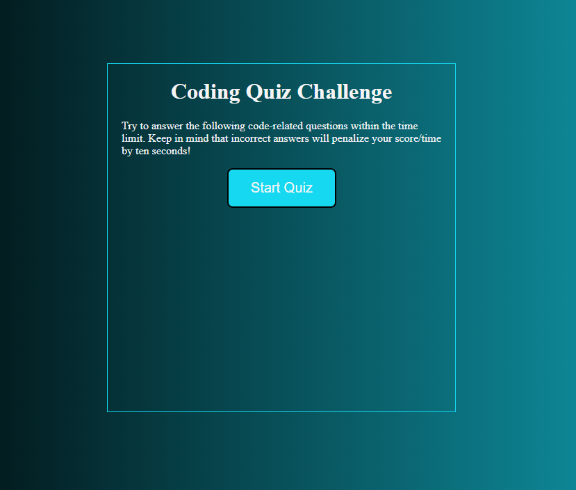
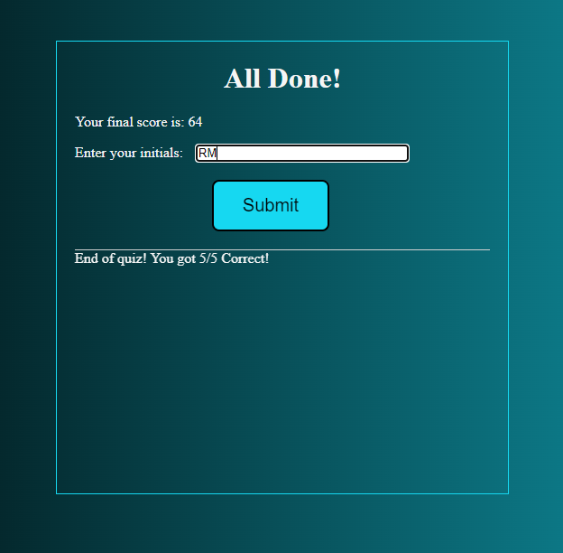
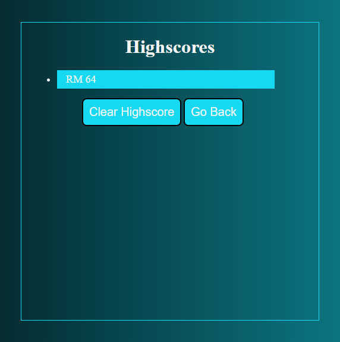

# <Code-Quiz>

## Description

This quiz will test your knowledge on the fundamentals of coding, take it and track the high scores!

## Usage

To use just press 'Start' and answer the questions within the time limit to get your score at the end!

Once you have your score, enter your initials and click 'Submit'.

You will then be directed to the High Scores where you can either clear them or go back and try again!

You can try for yourself here: https://itsssbobby.github.io/Code-Quiz/

